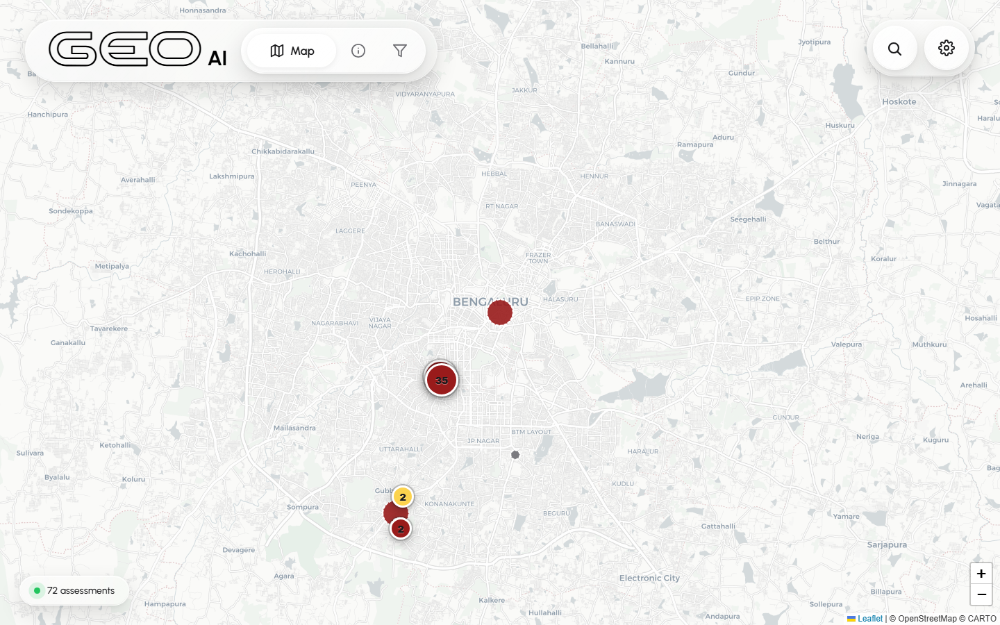
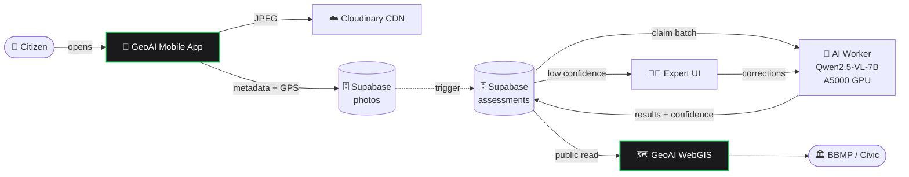
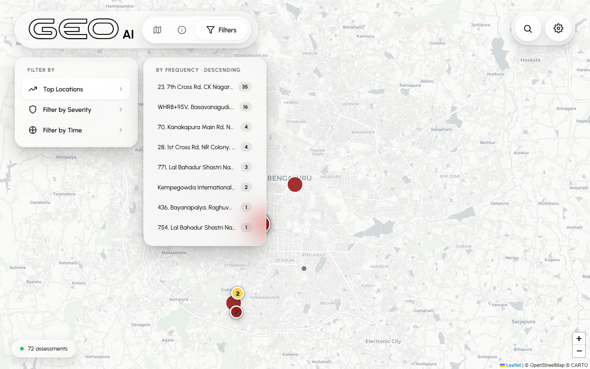
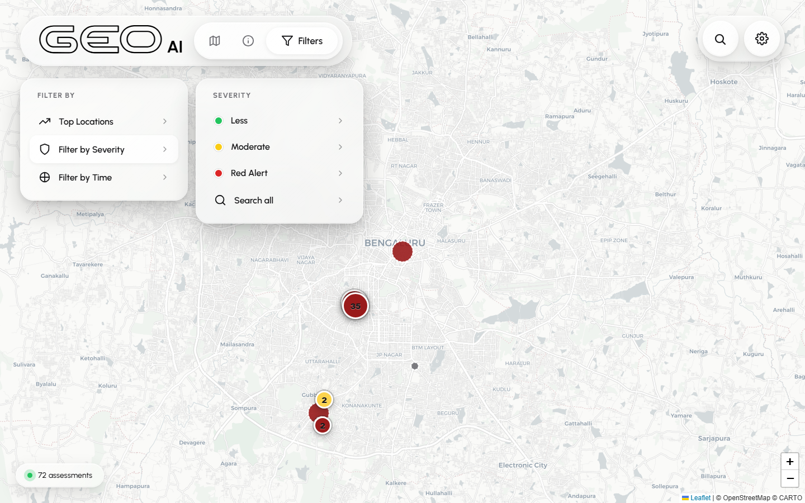
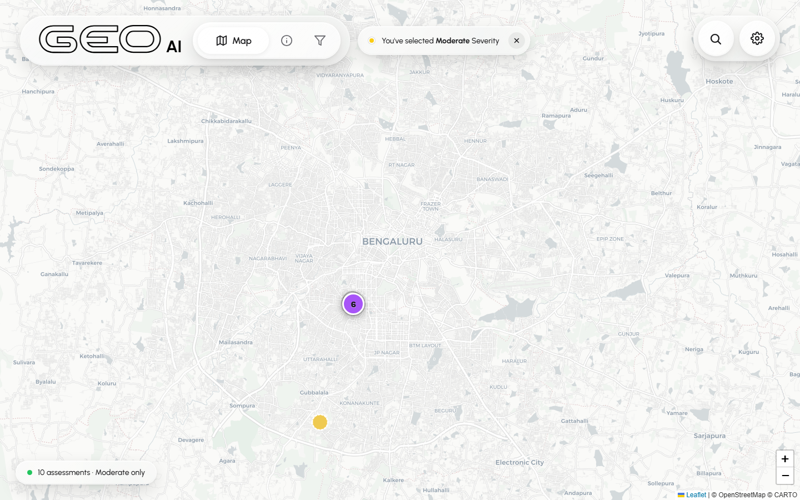
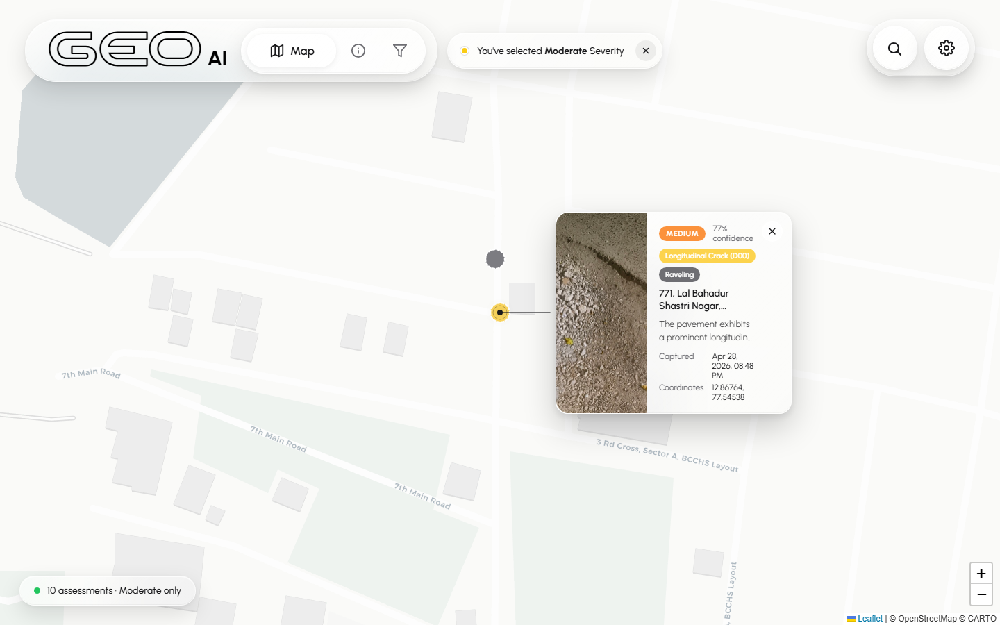
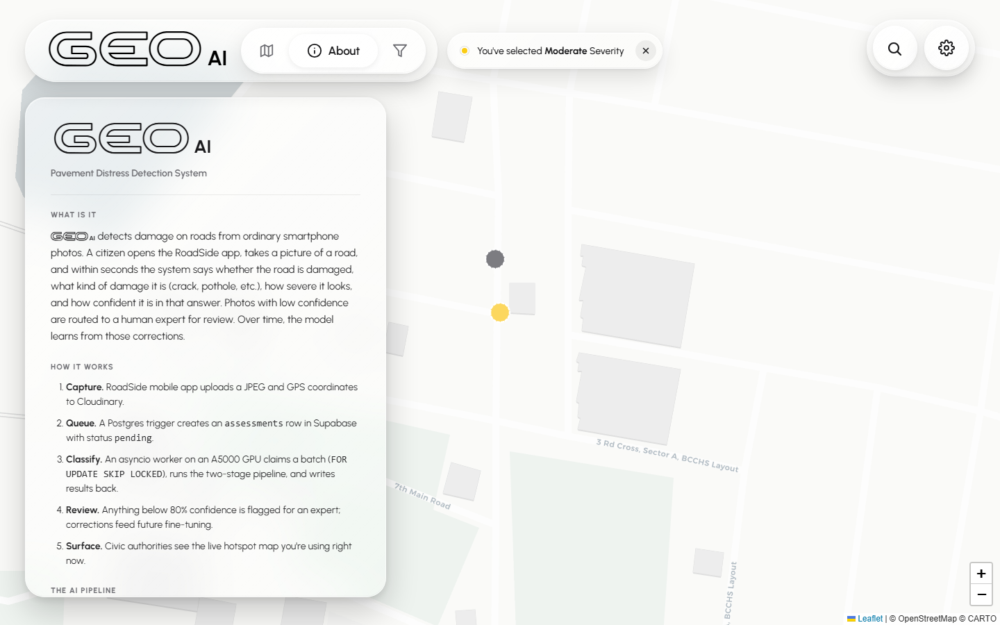
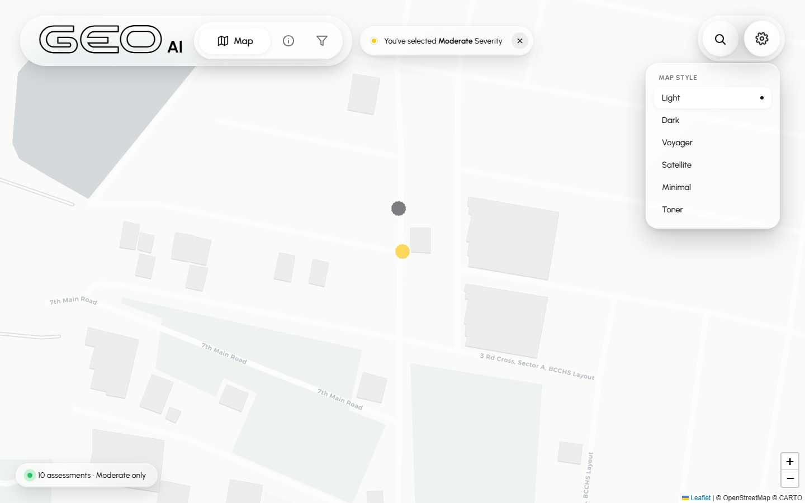
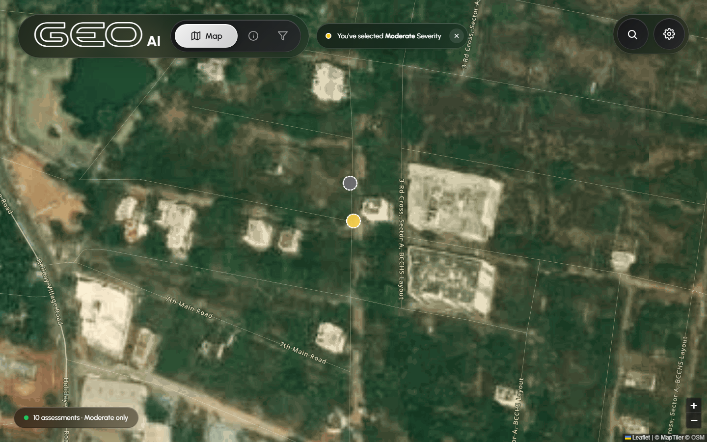

<div align="center">

# 🛣️ GeoAI

**Pavement Distress Detection System**

*Citizens snap photos of damaged roads — AI classifies each one — civic authorities see hotspots in real time.*

[](LICENSE)
[](#)
[](#stack)
[](#authors)

[**Live Demo**](https://gisgeoai.netlify.app) · [**Web Dashboard**](#-web-dashboard) · [**Mobile App**](#-mobile-app) · [**Architecture**](#-architecture)

<br/>



</div>

---

## 📍 Overview

GeoAI is an end-to-end civic-tech system that turns citizen smartphone photos into actionable road-maintenance intelligence. A two-stage vision-language model (Qwen2.5-VL-7B fine-tuned on RDD2022 + GAPs V2) classifies each photo into a **distress type** (longitudinal crack, transverse crack, alligator crack, pothole, block crack) with **severity** (Less / Moderate / Red Alert) and a **confidence score** read directly from raw model logits — not from string matching.

This repo holds the **two client-facing pieces** of that system:

| | What it does |
|---|---|
| 🗺️ **WebGIS** *(this repo's root)* | Civic-authority hotspot map. Renders classified assessments from Supabase on a Leaflet map with smart clustering, severity & day/night filtering, and JARVIS-style detail cards. |
| 📱 **Mobile** *(`mobile/`)* | Native Android (Kotlin) capture client. CameraX preview, pinch-zoom 1:1 crop, flash toggle, low-light hint, 10-second live location refresh. Uploads to Cloudinary + writes to Supabase. |

The AI pipeline, FastAPI server, expert-review UI, and Supabase schema live in the team's GPU-server repository — they're not in this repo.

---

## 🏗️ Architecture



> Components highlighted in green border are in **this** repo. Everything else is the team's broader system.

---

## 🗺️ Web Dashboard

Vanilla HTML/CSS/JS — **no build step**. Drop the repo onto Netlify or push to GitHub Pages and you're live.

### What's in it

- 🎨 **6 basemap styles** — light, dark, voyager, satellite, minimal, toner. UI chrome auto-flips to a dark theme on dark maps.
- 📍 **14m geographic clustering** of overlapping markers, with multi-card cluster expansion (up to 3 cards + view-more)
- 🎯 **JARVIS-style anchored detail cards** — pinch-aware connectors, radar pulse on click, 2s spinner→reveal animation
- 🌅 **Civil-twilight day/night detection** per-marker — uses real sun-position math, not a hardcoded clock. Dashed border on night captures.
- 🔍 **Cascading filters** — top locations by frequency, severity (Less / Moderate / Red Alert), time of day. Active filters drop pills next to the brand.
- 💾 **Stale-while-revalidate `localStorage` cache** with 10-min TTL — saves Supabase reads, page loads from cache instantly

### What it looks like

<table>
  <tr>
    <td width="50%"><a href="docs/screenshots/02-filters-top-locations.png"></a><br/><sub><b>Filters → Top Locations.</b> Cascading panels show the highest-frequency capture sites with counts.</sub></td>
    <td width="50%"><a href="docs/screenshots/03-filters-severity.png"></a><br/><sub><b>Filters → Severity.</b> Less / Moderate / Red Alert / Search-all options.</sub></td>
  </tr>
  <tr>
    <td width="50%"><a href="docs/screenshots/04-severity-moderate-active.png"></a><br/><sub><b>Severity filter locked in.</b> Pill next to the brand shows what's active; map shows only matching markers.</sub></td>
    <td width="50%"><a href="docs/screenshots/05-detail-card.png"></a><br/><sub><b>JARVIS-style detail card.</b> Click any marker → flyTo → radar pulse → loading spinner → reveal.</sub></td>
  </tr>
  <tr>
    <td width="50%"><a href="docs/screenshots/06-about-card.png"></a><br/><sub><b>About page.</b> Project overview, AI pipeline, severity scale, tech stack, roadmap, authors.</sub></td>
    <td width="50%"><a href="docs/screenshots/07-settings-map-styles.png"></a><br/><sub><b>6 basemap styles.</b> Light, Dark, Voyager, Satellite, Minimal, Toner — each remembered per-user.</sub></td>
  </tr>
  <tr>
    <td colspan="2" align="center"><a href="docs/screenshots/08-dark-satellite.png"></a><br/><sub><b>Auto dark chrome on dark maps.</b> Pills, text, icons all flip to white when the basemap is dark.</sub></td>
  </tr>
</table>

### Tech

`Leaflet 1.9` · `MapTiler` · `Supabase JS v2` · `Nominatim` · vanilla ES2020

---

## 📱 Mobile App

Native Android (Kotlin) capture client. See [`mobile/README.md`](mobile/README.md) for full docs.

### What's in it

- 📷 **CameraX preview** with single-tap shutter and persistent **6-second cooldown** between captures (survives app close)
- 🔆 **Flash toggle** — off / on / auto cycle, with an animated status pill
- 💡 **Low-light hint** — `ImageAnalysis` reads live preview luminance; drops a "Low light · try flash" pill when the scene gets dim and flash is off
- 🌍 **10-second live location refresh** via `FusedLocationProviderClient.requestLocationUpdates` — every capture grabs the latest fix, so photos taken while moving don't cluster at the launch coordinates
- ✂️ **Custom 1:1 crop with pinch-zoom (1×–6×) and drag-pan** — rule-of-thirds grid, live zoom-level badge, snaps to integer pixel boundaries

### Build

```bash
cd mobile
./gradlew assembleDebug      # debug APK
./gradlew assembleRelease    # debug-signed release APK for sideloading
```

`minSdk = 26` (Android 8.0 Oreo, ~94% of devices) · `targetSdk = 36` (Android 16)

---

## 📂 Repo Layout

```
geoai/
├── index.html                      # WebGIS entry point
├── app.js                          # All client logic (data, clusters, filters, cards)
├── styles.css                      # Liquid-glass design system
├── fonts/rostex.outline.ttf        # Custom outline font for the GEO mark
│
├── mobile/                         # Native Android capture app
│   ├── app/src/main/
│   │   ├── java/com/example/msc/   # Kotlin sources
│   │   ├── res/                    # Layouts, drawables, themes
│   │   └── AndroidManifest.xml
│   ├── build.gradle.kts
│   └── README.md                   # Mobile-specific docs
│
├── README.md                       # ← you are here
├── LICENSE                         # MIT
└── .gitignore
```

---

## 🧭 Project Roadmap

| Phase | Status | What |
|---|---|---|
| 1 | ✅ Done | Two-stage AI pipeline · real-time worker · expert UI · baseline eval |
| 2 | ✅ Done | **GeoAI WebGIS** (this repo) · civic hotspot map |
| 3 | ✅ Done | **GeoAI Mobile** (this repo) · citizen capture client |
| 4 | 🚧 Next | QLoRA fine-tuning on RDD2022 + GAPs V2 combined dataset |
| 5 | 🚧 Next | Expert-in-the-loop few-shot prompt injection + LoRA incremental retraining |

---

## 🚀 Deploy

The WebGIS deploys to **Netlify** with no build step. Either drag the repo onto [Netlify Drop](https://app.netlify.com/drop) for a one-shot deploy, or connect this GitHub repo for auto-deploys on every push to `main`.

**Build command:** *(empty)* · **Publish directory:** `.`

### Optional: Redis cache (Upstash) to cut Supabase reads

The site ships with a Netlify Function at `netlify/functions/assessments.js`
that sits between the browser and Supabase. On a cache hit it returns
the result from **Upstash Redis** in ~30 ms; on a miss it fetches from
Supabase and warms the cache for 5 minutes. One shared cache for every
visitor — Supabase only gets hit once per 5-min window even with
thousands of users.

The function is **already in this repo and deployed automatically by
Netlify**. It runs without Upstash too — if the env vars below aren't
set, it just passes through to Supabase. Configuring Upstash is what
flips the cache on.

**Setup (~3 min):**

1. Sign up at https://upstash.com (free tier, no credit card)
2. Create a Redis database. Copy the **REST URL** and **REST Token**.
3. In Netlify → **Site settings** → **Environment variables** → add:
   - `UPSTASH_REDIS_REST_URL`   = your URL (looks like `https://xxx.upstash.io`)
   - `UPSTASH_REDIS_REST_TOKEN` = your token
4. Trigger a redeploy (push any commit, or **Deploys** → **Trigger deploy**).

After that, watch the browser console — you'll see lines like
`[GeoAI] data via netlify-fn (HIT, 38ms)` confirming Redis is in the
loop. The first request after cache expiry shows `MISS` and takes a
bit longer; subsequent ones inside the 5-min window are HITs.

The browser-side `localStorage` cache stays — it's the L1 cache.
Redis is L2 (shared across users). Supabase is the source of truth.

---

## 👥 Authors

**Suraj** · **Richik Chaudhuri** · **Sushant Deo**

Capstone Project · **B.M.S. College of Engineering**, Bengaluru · April 2026

---

## 📄 License

[MIT](LICENSE) — feel free to fork, learn from, and adapt for your own civic-tech projects.
