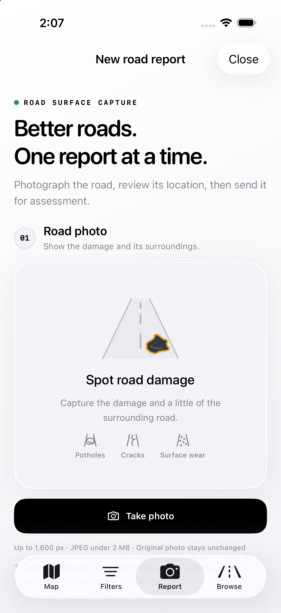

# GeoAI for iOS

A native SwiftUI and MapKit client for the GeoAI road-damage platform. It includes a map dashboard, severity filters, horizontal assessment cards, road and distress icons, and camera reports with capture time and location metadata.

## Run

1. Open `GeoAI.xcodeproj` with **Xcode 26 or newer**. The app targets **iOS 17+**.
2. Select the **GeoAI** scheme and an iPhone simulator, then Run.
3. For a physical iPhone, select your development team in Signing & Capabilities, use a unique bundle identifier as needed, and choose the connected device. No personal signing team is committed.

The app opens without credentials using the website's May 25, 2026 demo snapshot of 79 observations. Apple Maps, place search and remote photos need internet access. The last successful metadata load is cached; maps and photos are not fully available offline.

Camera reporting requires a physical device. The simulator shows an explicit message instead of attempting camera startup. The latest camera lifecycle changes compile but **still require verification of the live preview and capture on a physical iPhone**; see [verification](VERIFICATION.md).

## Experience

- Native Map, Filters, Report and Browse tabs, with Liquid Glass and the selected-tab pill on iOS 26+; earlier releases use system material styling.
- Six map appearances, clustered severity dots, night-capture outlines and a pulse on selection.
- A road overview card that swipes above the tab bar and collapses behind it.
- Assessment cards slide horizontally with Next, Previous or swiping; opening a marker retains the upward entrance.
- Vector road artwork with pothole, crack, alligator-crack, bleeding and surface-wear symbols. Unknown observations keep a neutral road icon.
- Camera-only reporting, protected drafts, image resizing, coordinate review and retry/reconciliation handling.
- Debounced place search, paginated data loads, expert-correction precedence and explicit demo/saved/live indicators.



## Connect live data

All four service values in `GeoAI/Resources/Configuration.plist` are blank. `Configuration.example.plist` is a reset template.

| Field | Value |
|---|---|
| `SupabaseURL` | HTTPS Supabase project URL |
| `SupabasePublicKey` | Publishable key (`sb_publishable_…`) or legacy `anon` JWT |
| `CloudinaryCloudName` | Cloudinary cloud name |
| `CloudinaryUploadPreset` | Unsigned image-upload preset |

MapKit requires no additional map API key. Keep service-role keys, database passwords, Cloudinary secrets and AI-provider keys on the backend; the iOS client rejects privileged Supabase keys.

The backend must provide public-role reads for the intended `photos` and `assessments` rows, permitted inserts into `photos`, receipt lookups by image URL, the existing assessment trigger/worker, and a suitable unsigned Cloudinary image preset. See [capture timestamp setup](Backend/README.md) before enabling uploads. The companion backend repository includes `migrations/005_photos_captured_at.sql`; the identical migration is bundled here as `Backend/001_photos_captured_at.sql` for standalone setup. Apply it once to the intended database. Publishing this source does not apply the migration or change live policies.

New photo inserts contain `image_url`, `latitude`, `longitude`, `address` and nullable `captured_at`. The existing `created_at` upload timestamp and FIFO queue ordering remain unchanged. The app uses direct Supabase/Cloudinary interfaces, not the FastAPI expert-review service.

## Capture and draft behavior

Capture time is recorded in the shutter callback. GPS is accepted only if it is within 15 seconds of that event, has valid coordinates and reports accuracy of 150 metres or better. Missing permission or a fresh fix leaves coordinates available for manual entry. Capture time and reviewed coordinates are uploaded; GPS accuracy, fix time and provenance remain in the local draft.

The resized JPEG is at most 1,600 pixels along its longest edge and under 2 MB. Timestamp and geotag are separate report metadata, not a watermark or embedded EXIF in that resized image. The removed library picker cannot import new images; legacy imported drafts remain readable.

The camera waits for an active app, visible view and rendering preview before enabling its shutter. Temporary interruptions pause and resume. A protected local `Library/Application Support/camera-diagnostics.json` snapshot records session/preview state, bounds and error codes only; it contains no media or location data and is excluded from backup.

A single protected draft survives app launches and is excluded from backup. Closing Report saves it. Discarding removes the local draft, not any already-uploaded asset. Interrupted database submissions become **Check submission** and query for an existing receipt before an explicit retry. Full duplicate prevention still requires server-side uniqueness; an interrupted Cloudinary response may leave an unused asset. Keep the app open during submission; background/resumable transfers are not implemented.

Known capture times determine day/night. Explicit null remains unknown. Older schemas/snapshots that omit `captured_at` retain the historical upload-time fallback. The migration does not reconstruct capture times for old records.

## Development and validation

`project.yml` is the XcodeGen source. Run `xcodegen generate` after adding source files outside Xcode. The generated project and shared scheme are committed. `Packages/GeoAICore` contains Foundation-only models, parsing, filtering and REST behavior; there are no third-party runtime dependencies.

From this directory, with full Xcode selected:

```sh
DEVELOPER_DIR=/Applications/Xcode.app/Contents/Developer \
  xcrun swift test --package-path Packages/GeoAICore
DEVELOPER_DIR=/Applications/Xcode.app/Contents/Developer \
  bash Scripts/verify-capture.sh
```

Additional scripts: `Scripts/check-catalyst.sh` and `Scripts/check-core.sh`. See [VERIFICATION.md](VERIFICATION.md) for actual checks and remaining hardware/backend work. Complete backend authentication, abuse controls, privacy disclosures and App Store requirements before distribution.

Based on this repository's design and the [GeoAI backend](https://github.com/Suraj-B12/GeoAI). Original font and snapshot licensing is retained in `UPSTREAM-LICENSE`.
